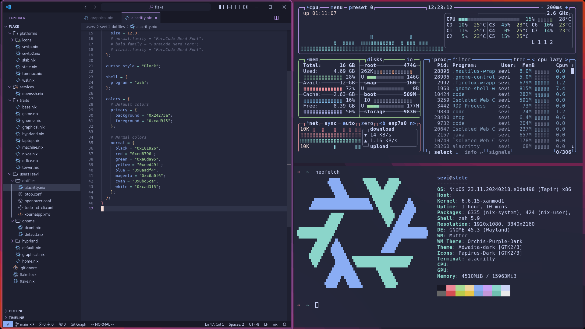

<h2 align="center">Ottoblep NixOS Configurations :ear_of_rice:</h2>

  

<h4 align="center">You may not like it, but this is what peak gnome looks like.   This flake contains my workstation setups, devShells and some obscure packages I use.</h4>
<h4 align="center"></h4>

